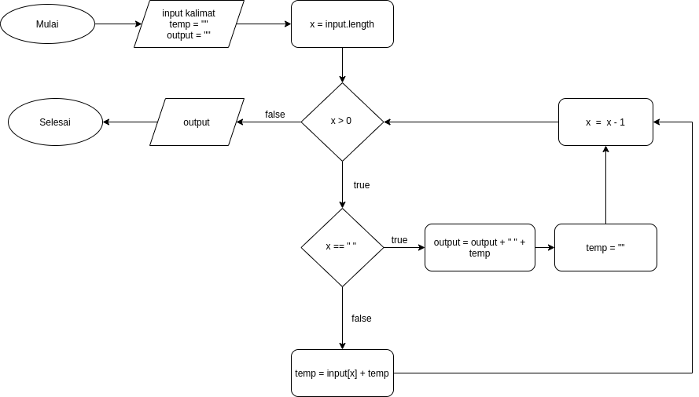

# **Palindrom**

## A. Algoritma Palindrome

    1. mulai
    2. input Teks dan membuat variabel penampung (y);
    3. proses mulai perulangan(x) yaitu jumlah keseluruhan total input (input.length)
    4. proses pengecekan apakah x lebih dari 0
    5. jika true ke nomor 7
    6. jika false ke nomor 10
    7. isi variabel y yaitu y ditambah input ke-x kemudian ke nomor 8
    8. nomor urut di kurangi 1 kemudian ke nomor 9
    9. kembali ke perulangan mulai nomor 4
    10. apakah y sama dengan input teks
    11. jika true maka cetak 'palindrome'
    12. jika false maka cetak 'bukan palindrome'
    13. selesai

## B. Flowchart Palindrom

# **Reverse Words**

## A. Algoritma Reverse Words

    1. mulai
    2. input kalimat dan deklarasikan variabel temp dan output untuk variabel tampung
    3. proses mulai perulangan(x) yaitu jumlah keseluruhan total input (input.length)
    4. apakah x lebih dari 0
    5. jika true ke nomor 7
    6. jika false ke nomor 15
    7. apakah x itu spasi
    8. jika true ke nomor 13
    9. jika false ke nomor 10
    10. isi variabel temp yaitu input ke-x ditambah variabel temp kemudian ke nomor 11
    11. x dikurangi 1 kemudian ke nomor 12
    12. kembali ke perulangan mulai nomor 4
    13. isi variabel output yaitu variabel output + spasi + variabel temp kemudian ke nomor 14
    14. kosongkan variabel temp kemudian ke nomor 11
    15. outputkan variabel output
    16. selesai

## B. Flowchart Reverse Words

# **Ganti Huruf**

## A. Algoritma Ganti Huruf

    1. mulai
    2. input kata buat variabel temp dan result untuk variabel tampung
    3. proses mulai perulangan (x) = 0
    4. apakah x kurang dari input.length
    5. jika true ke nomor 7
    6. jika false ke nomor
    7. apakah x itu huruf "a"
    8. jika true ke nomor 13
    9. jika false ke nomor 10
    10. isi variabel temp yaitu variabel temp ditambah input ke-x kemudian ke nomor 11
    11. x ditambah 1 kemudian ke nomor 12
    12. kembali ke perulangan mulai nomor 4
    13. ganti huruf "a" menjadi "o" kemudian
    14. isi variabel result yaitu variabel result + variabel temp + "o" kemudian ke nomor 14
    14. kosongkan variabel temp kemudian ke nomor 11
    15. outputkan variabel result
    16. selesai

## B. Flowchart Ganti Huruf

